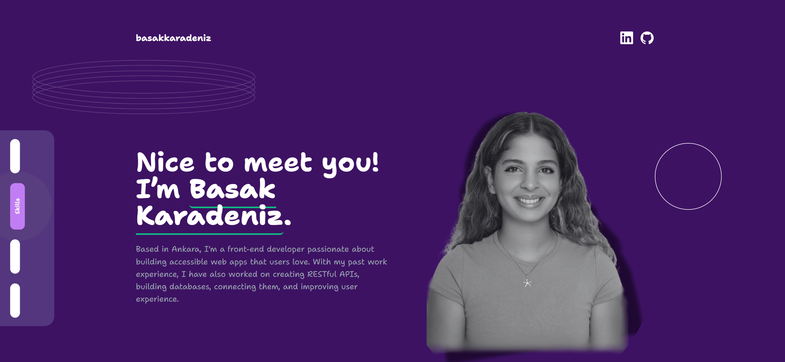
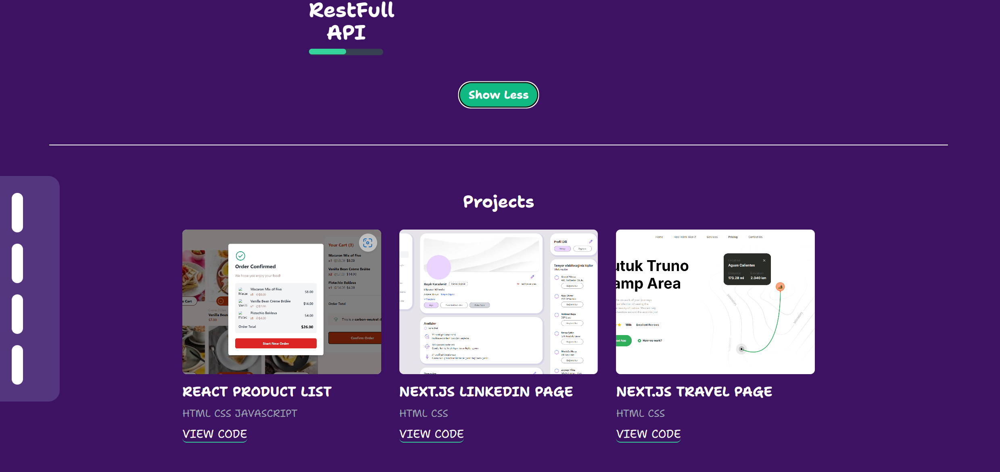
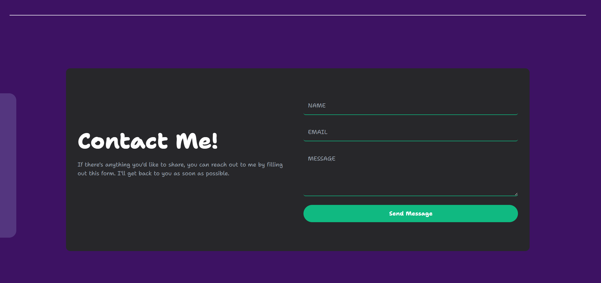

# Overview
My Portfolio is a fully responsive and interactive web application built using **React.js** to showcase my skills, projects, and allow visitors to contact me. The portfolio highlights my abilities as a frontend developer and demonstrates my proficiency in building **single-page applications (SPA)** with smooth transitions and engaging layouts.

This portfolio features key sections including **Hero, Skills, Projects**, and **Contact** to provide a structured and visually appealing presentation of my work. It's designed with simplicity and functionality in mind, ensuring a seamless user experience across all devices.

# Live Demo
Check out the live version of the portfolio [here](https://portfolio-react-git-main-basaks-projects.vercel.app/).

# Features
- **Responsive Design**: The portfolio is optimized for both desktop and mobile devices, ensuring an accessible experience for all users.
- **Dynamic Components**: Each section is a separate React component, making the application modular and easy to maintain.
- **Smooth Scroll Navigation**: Users can easily navigate between sections using the NavBar links, which scroll smoothly to the respective sections.
- **Projects Showcase**: The portfolio dynamically displays featured projects with details and links to the live demos or GitHub repositories.
- **Contact Form**: A fully functional contact form for users to get in touch directly from the site.
- **Custom Styling**: Unique custom styles applied using CSS classes and the font-spacegrotesk font.

# Tech Stack
### Frontend:
- **React.js**: Core framework for building the UI.
- **JavaScript**: To handle interactivity and component logic.
- **CSS**: For styling, layout design, and responsiveness.
- **HTML**: Structuring the components and layout.

### Tools:
- **Git & GitHub**: Version control and repository management.
- **Node.js**: For backend integration and server-side logic.

# Additional Notes
- The project started with a **mobile-first** design approach, later expanded to larger screen sizes.
- I used a **one-page web layout** with visually appealing component organization and styling.

# Screenshots

- 
  
- 
  
- 
